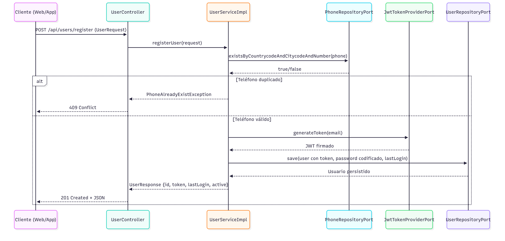
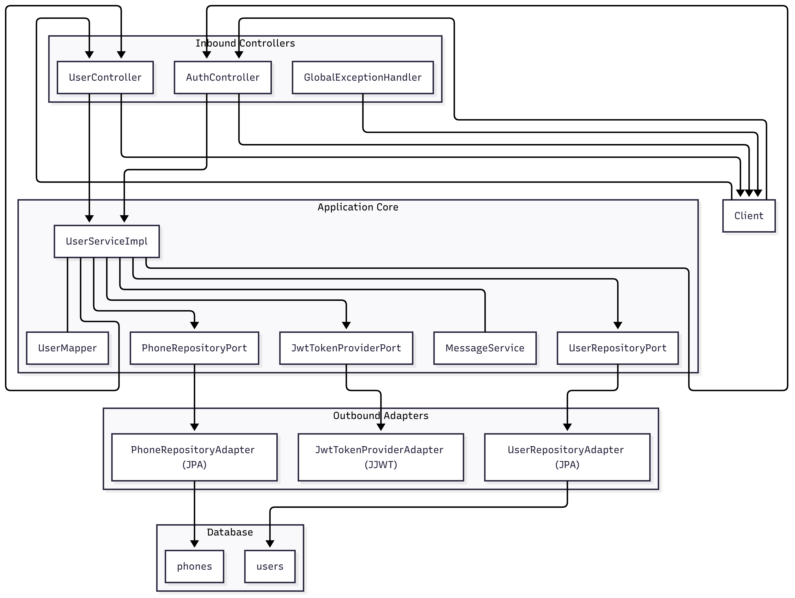

# Challenge — Sistema de Gestión de Usuarios

## Diagramas

  
*Diagrama de secuencia del registrar usuario (Secuencia)*

  
*Diagrama de Contexto (DFD-0)*

  
*DFD-1 — Login*

  
*DFD-1 — Registrar Usuario*

  
*Arquitectura Hexagonal de la solución*

---

## Descripción de la solución

Este proyecto implementa un **sistema de gestión de usuarios** con registro y login, diseñado con una **arquitectura hexagonal (puertos y adaptadores)**.

La idea central es separar la **lógica de negocio** de los detalles de infraestructura, de forma que el núcleo de la aplicación no dependa de frameworks ni tecnologías externas. Esto ofrece un sistema **modular, mantenible y testeable**.

- Los **controllers** exponen los endpoints REST y convierten requests/responses.
- El **servicio de usuarios** aplica las reglas de negocio (validación de email y password, unicidad de teléfonos, generación de JWT *antes de persistir*, actualización de `lastLogin`).
- Los **ports** definen contratos para repositorios de usuarios y teléfonos, y para la generación de JWT.
- Los **adapters** implementan esos contratos con tecnologías concretas: JPA/H2 para persistencia y JWT para los tokens.
- Un **manejador global de excepciones** transforma errores en respuestas HTTP claras (`400`, `401`, `409`, etc.).

---

## Cómo iniciar el proyecto y probar Swagger

1. Clona el repositorio y entra en la carpeta del proyecto:

   ```bash
   cd challenge
   ```

2. Levantar la aplicación con Gradle (requiere Java 21):

   ```bash
   ./gradlew bootRun
   ```

3. Abrir en el navegador (debería redirigir al swagger):

   ```
   http://localhost:8080
   ```

   Desde ahí se pueden probar los endpoints:
   - `POST /api/users/register`
   - `POST /api/auth/login`

Tip: Para probar los mensajes en Español o Inglés desde Swagger, agrega el header `Accept-Language` (por ejemplo, `es` o `en`) en la sección de "Headers" del endpoint. Valores soportados: `es`, `en`.

---

## Cómo correr las pruebas

### Unitarias e integración
Ejecutar:
```bash
./gradlew clean test
```

### Lint (Checkstyle)
El lint se ejecuta automáticamente durante `build` como parte de la tarea `check`.
Para ejecutarlo manualmente:
```bash
./gradlew checkstyleMain checkstyleTest
```
Los reportes se generan en:
```
build/reports/checkstyle/
```
Por ahora, las infracciones de estilo no fallan el build (`ignoreFailures=true`).

### Mutation Testing (PIT)
Ejecuta:
```bash
./gradlew pitest
```

Los reportes quedarán en:
```
build/reports/pitest/index.html
```

## Uso del Makefile (requiere make instalado)

Antes de usar los comandos del makefile se debe tener instalado `make`:
- Linux/macOS: generalmente viene preinstalado o se instala con el gestor de paquetes (por ejemplo, `sudo apt-get install make`, `brew install make`).
- Windows: instala "make" (por ejemplo, con Chocolatey `choco install make`).

Verificar la instalación con:
```bash
make --version
```

Dentro del directorio del proyecto puedes ejecutar:
- `make run` — Inicia la aplicación (equivale a `./gradlew bootRun`).
- `make build` — Compila y empaqueta el proyecto (equivale a `./gradlew build`).
- `make clean` — Limpia artefactos de compilación (equivale a `./gradlew clean`).
- `make test` — Ejecuta las pruebas unitarias (equivale a `./gradlew test`).
- `make test-integration` — Ejecuta las pruebas de integración (equivale a `./gradlew integrationTest`).
- `make test-all` — Ejecuta todas las verificaciones (equivale a `./gradlew check`).

Nota: En Windows, si se usa PowerShell o CMD, `make` debe estar en el PATH.

---
